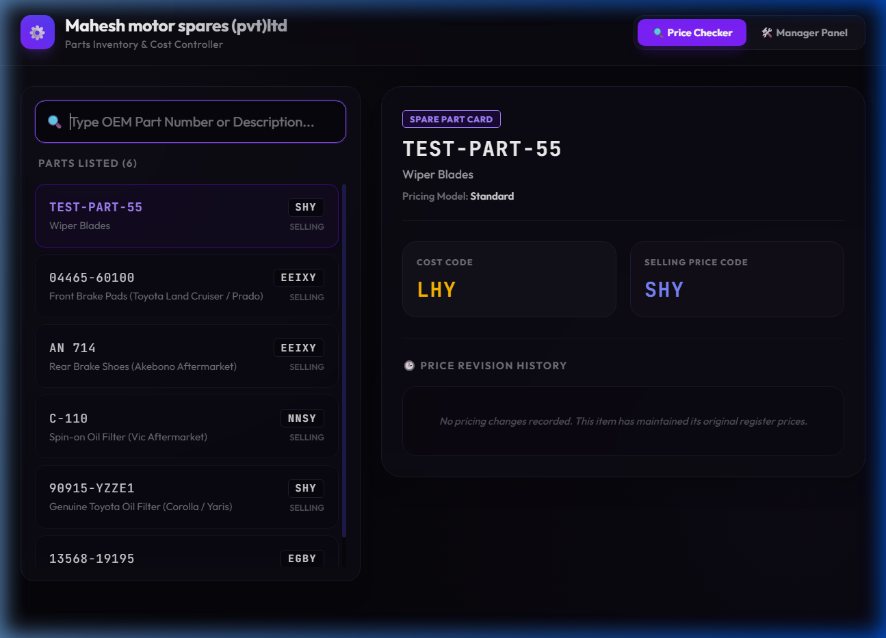
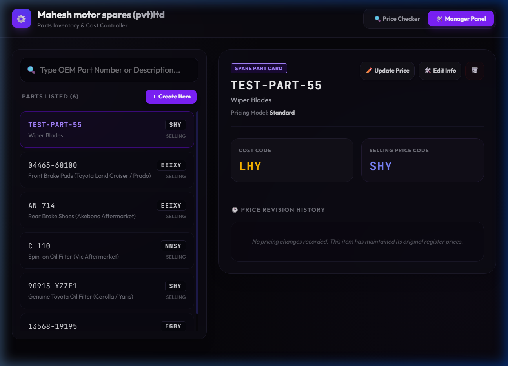

# Client User Guide - Mahesh Motor Spares (Pvt) Ltd
## Parts Inventory & Cost Controller System

Welcome to the **Mahesh Motor Spares Parts Inventory & Cost Controller** user guide. This system allows your shop to securely store spare parts, update prices, and search items using a safe letter-based pricing cipher system.

---

## 1. How to Setup & Run the App

### Step 1: Install Node.js
To run this application locally, you must have **Node.js** installed on your computer:
1. Go to [https://nodejs.org/](https://nodejs.org/) and download the **LTS** version for Windows.
2. Double-click the installer and follow the instructions to complete setup.

### Step 2: Install dependencies
1. Open the project folder (`price`) in your terminal or command prompt.
2. Run the command:
   ```bash
   npm install
   ```
   This downloads all necessary development packages and libraries.

### Step 3: Run the Application
You can start the app in two ways:
- **Option A (Double-Click shortcut)**: Double-click the `start_app.bat` script file inside the project directory.
- **Option B (Terminal command)**: Open command prompt in the directory and run:
   ```bash
   npm run dev
   ```
- Once started, open your web browser (Chrome, Edge, or Firefox) and navigate to:
  ```
  http://localhost:5174/
  ```

---

## 2. The Cipher Code System

The system uses a custom **10-letter secret code word** to represent numbers. 
The code word is **`ENGLISHBOY`** + **`X`** for extra zeros:

| Digit | Cipher Letter |
| :--- | :--- |
| **1** | E |
| **2** | N |
| **3** | G |
| **4** | L |
| **5** | I |
| **6** | S |
| **7** | H |
| **8** | B |
| **9** | O |
| **0** | Y (first zero) / X (second zero) |

### 0-Alternation Rule:
When representing numbers with multiple zeros, the zeroes alternate to match your manual notebook patterns:
* First zero from the right = **`Y`**
* Second zero from the right = **`X`**
* Third zero = **`Y`** (and so on)

### Examples:
* **`ONLY`** = `9240` (O=9, N=2, L=4, Y=0)
* **`EEIXY`** = `11500` (E=1, E=1, I=5, X=0, Y=0)
* **`EBIY`** = `1850` (E=1, B=8, I=5, Y=0)
* **`ES`** = `16` (E=1, S=6)
* **`OI`** = `95` (O=9, I=5)

---

## 3. How to Work Every Part of the App

The application features a modern tabbed layout designed to separate search lookups from administrative edits:

### Part A: 🔍 Price Checker (Default View)
This is the read-only dashboard used by counter staff during normal operations:
1. **Search Bar**: Type any OEM part number/SKU (e.g. `04465-60100`) or compatibility terms (e.g. `Toyota`) into the top input bar. The list updates instantly.
2. **Details Card**: Click on any item from the left sidebar to view details on the right:
   * **OEM Part SKU & Description** are displayed.
   * **Price Codes**: Displays Cost Code, Selling Price Code, and Discount Code.
   * **No Numbers/Decimals**: Prices are displayed as pure cipher codes (like `ONLY` or `EEIXY`). Absolutely no dollar signs (`$`) or decoded numbers are shown.
   * **🕒 Price Revision History**: Displays previous codes and dates when prices were updated.



---

### Part B: 🛠️ Manager Panel View
This tab houses all administrative controls. It allows you to create new items, change prices, and delete parts.

To open, click **Manager Panel** at the top right:
1. **Register New Item**: Click `＋ Create Item` to open the creation form.
   * Fill in SKU and description.
   * Select a **Pricing Model** (Standard, Imported, or Discount).
   * Enter the **raw cipher strings** (like `ONLY`, `EEIXY`, `EBIY`, `NI`) directly. Valid letters are automatically kept, while invalid letters are blocked.
2. **Update Pricing**: Click `✏️ Update Price` next to an item in the details card. Select the pricing model and type in the new cipher codes directly. The change is saved instantly and added to the revision history timeline.
3. **Edit Info**: Click `🛠️ Edit Info` to update the SKU or Description.
4. **Delete**: Click `🗑️` to permanently remove the item.



---

## 4. Understanding Pricing Models

When creating or updating items in the **Manager Panel**, you can choose from three structures:

### 1. Standard (Direct Cost & Selling)
* Direct entry of **Cost Code** (e.g., `ONLY` for 9240) and **Selling Code** (e.g., `EEIXY` for 11500).

### 2. Imported (Price & Exchange Rate)
* For foreign imports where price and exchange rate are kept separately:
  * **Foreign Cost Code** (e.g., `ES` for 16)
  * **Exchange Rate Code** (e.g., `OI` for 95)
  * **Selling Code** (e.g., `EEIXY`)
* **Calculated Cost Code Preview**: The system automatically decodes these, multiplies them (`16 * 95 = 1520`), encodes it back, and displays the preview `EINY` in real-time.

### 3. Discount (Cost & Discount Margin)
* For items bought with discounts:
  * **List Cost Code** (e.g., `EBIY` for 1850)
  * **Discount Code** (e.g., `NI` for 25)
  * **Selling Code** (e.g., `NNSY`)
* **Calculated Net Cost Code Preview**: The system automatically decodes, subtracts the discount (`1850 - 25% = 1388`), encodes it back, and displays the preview `EGBB` in real-time.
